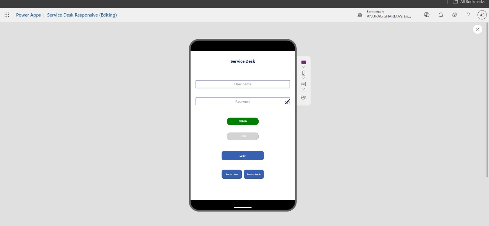
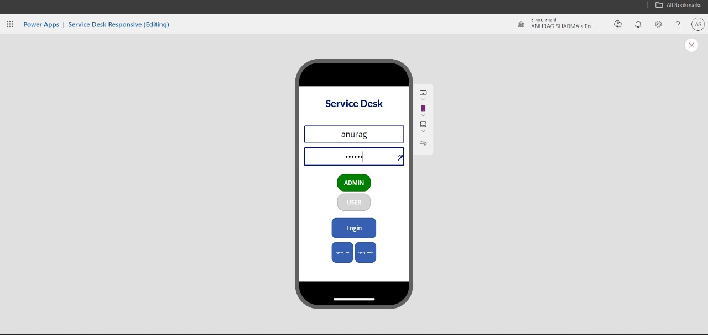

# Service Desk App


## Overview

The "Service Desk" app is a service management application created using Power Apps. This app enables users to generate service tickets and allows admins to manage and resolve these tickets efficiently.

## Demo Video & Screenshots

[Watch the demo video](https://1drv.ms/v/c/aaa79a7526bcedd4/EZf5gwWusgtHhEfL97MUpu8BriQHC2n3nDdCiTvKeZ3SbA?e=4gfQAA)

<p>
   
   
</p>

## Features

- *User Login*: Users can log in to the app using their credentials.
- *Ticket Generation*: Users can create new service tickets by providing necessary details.
- *Admin Dashboard*: Admins can view, manage, and resolve tickets.
- *Ticket Tracking*: Users can track the status of their submitted tickets.

## Tables Structure

### Tickets Table

- *BY*: Employee Id of the user who created the ticket.
- *TO*: Admin name assigned to the ticket.
- *DATE*: Date the ticket was created.
- *REASON*: Reason for creating the ticket.
- *TICKET ID*: Unique identifier for each ticket.

### User Table

- *User name*: Username of the user.
- *Name*: Full name of the user.
- *Employee Id*: Unique employee ID of the user.

### Admin Table

- *Admin name*: Username of the admin.
- *Name*: Full name of the admin.

## Getting Started

### Prerequisites

- Power Apps account
- Excel data sheet as the backend

### Installation

1. Clone the repository to your local machine.
   ```bash
   git clone https://github.com/anuragvisioner/service-desk-app.git
